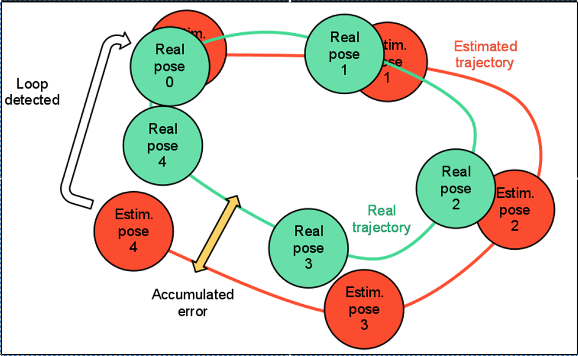
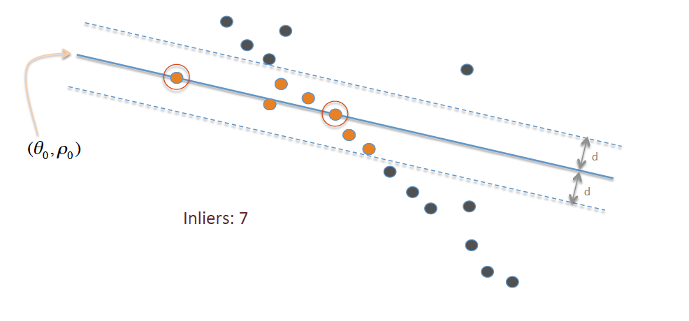
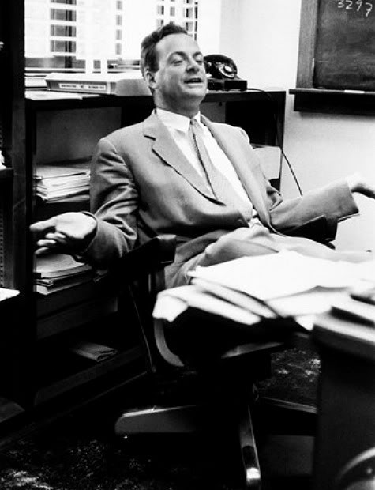
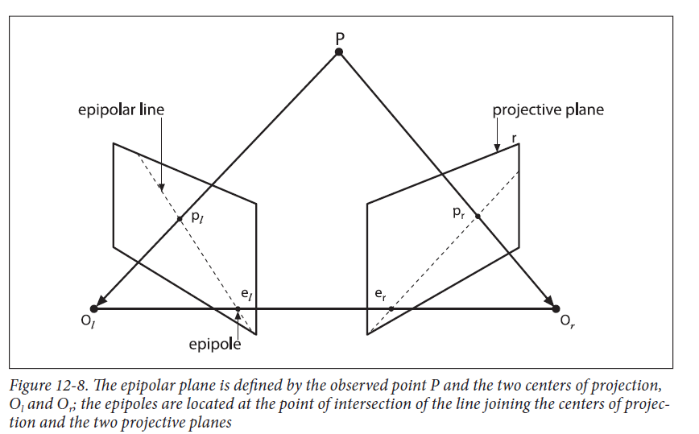
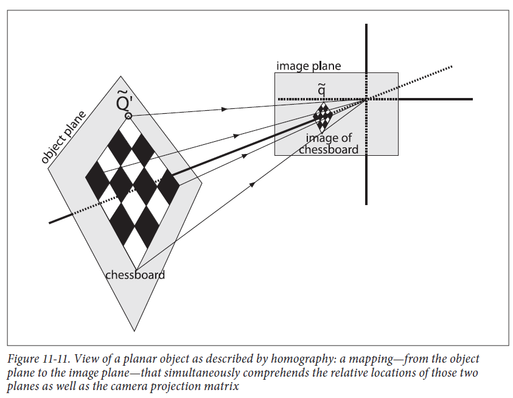
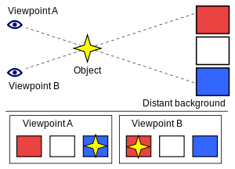
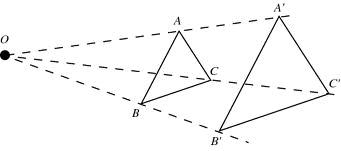

# Definitions

**Monocular**

- Only sensing device is a single camera
- Depth is not observable with just one camera
- Scale of map and estimated trajectory is unknown
- System bootstrapping require multi-view
- Scale drift problem
- True scale cannot be directly measured from a single camera
- Depth in monocular camera is calculated by integrating measurements from
multiple images over time 

**Scale**

The relationship between sizes in the real world and the map

Scale is basically the relationship between different distances in the
map (generally a cloud of 3D points), and how these distances relate to
the real world distances in the scene.

**Scale Drift**

Any inaccuracy in measurements, or problems in map reconstruction, can
cause the scale to gradually change over time.

**Stereo**

A stereo camera is a type of camera with two or more lenses with a
separate image sensor or film frame for each lens. Stereo cam allows
creating a 3D presentation

A stereo camera consists of simply two cameras separated by a fixed
distance; observations of the position of the same 3D point in both
cameras allows its depth to be calculated by triangulation.

**RGB-D**

RGB-D are a specific type of depth sensing devices that work in association
with a RGB camera, that are able to augment the conventional image with
depth information (related with the distance to the sensor) in a
per-pixel basis.

**Loop closing**

It is the task of deciding whether or not a vehicle has, after an excursion
of arbitrary length, returned to a previously visited area.

Loop closure is when two poses in the map are detected to correspond to
the same actual location, which means that by fusing them together, the
rest of the map can be adjusted to fit.

**Re-localization capabilities**

Recovery of camera pose after tracking failure

**Bundle Adjustment**

Refines a visual reconstruction to produce jointly optimal 3D structure
and viewing parameters

Bundle Adjustment is about “refining” the visual reconstruction of a
scene/environment based on a number of 3D points obtained from different
camera angles and parameters. Thus it is essentially about refining the
visual scene that is being reconstructed.

**Visual Odometry**

Is the process of determining the position and orientation of a robot by
analyzing the associated camera images.

**Photometric error**

Is the error due to your spectrometers light source and detector system
(as apposed to electronics noise, calibration errors.

**Keyframes**

Monocular SLAM was initially performed by filtering all the frames to jointly estimate the map and camera position. However, this wastes a lot of computational effort on processing consecutive frames with no new
information.

Selecting certain frames (keyframes) and performing costly but more accurate bundle adjustment operations produces better results. This way the mapping is also not related to the frame rate.

**Pose Graph Optimization**

The objective of pose graph optimization is to estimate robot trajectory
(collection of poses) from releative pose measurements

**Oriented FAST and rotated BRIEF (ORB)**

<https://en.wikipedia.org/wiki/Oriented_FAST_and_rotated_BRIEF>

**FAST**

Features from accelerated segment test (FAST) is a corner detection method, which could be used to extract feature points and later used to track and map objects in many computer vision tasks.

**Key-points**

Keypoints are the same thing as interest points. They are spatial locations, or points in the image that define what is interesting or what stand out in the image. The reason why keypoints are special is because no matter how the image changes... whether the image rotates,
shrinks/expands, is translated or is subject to distortion, you should be able to find the same keypoints in this modified image when comparing with the original image. 

**Tracked Point**

A map-point is said to be tracked if at-least one keyframe is observing/referring to it(map-point) 

**Feature**

AKA. Key-points

Usually corners are features.

Edges and flat areas are not good features because you cannot identify
the same feature given a new similar image input. 

**Feature Description**

The region around the feature, feature description makes it easy to find the earlier identified features in new image.

**Feature Descriptor**

Is usually a real-valued vector of fixed dimension that describes the neighborhood surrounding a feature point(i.e. feature description). 

**FAST**

Algorithm to detect features/corners

**BRIEF**

Algorithm to detect feature descriptors

**ORB**

OpenCV Algorithm to detect features using FAST and feature descriptors using BRIEF

**Vocabulary** 

All the features and feature descriptor from training dataset are processed and stored in offline file. 

DBoW2 creates a vocabulary structured as a tree, in an offline step over a big set of descriptors, extracted from a training image dataset. 

Processing a new image consist on extracting keypoints and their descriptors, which are assigned to a visual word traversing the vocabulary tree.

When a new keyframe arrives, we extract ORB features and associate a visual word to each descriptor, traversing the vocabulary tree

The generated visual word is used for detecting the loop candidates, by comparing the visual word from the current frame with the keyframe database.
 

**ORB_SLAM2's Vocabulary**

Using ORB Vocabulary a score is computed for each keyframe. If score is bad means new keyframe is not found in vocabulary.

If the new Keyframe is not found in vocabulary then match candidates will be empty. There is no mechanism to update the vocabulary at runtime. 

Match = Comparison between current keyframe with ORB vocabulary.
 

**RANSAC**

Random sample consensus is an iterative method to estimate parameters of a mathematical model from a set of observed data which contains outliers. It is a non-deterministic algorithm in the sense that it produces a reasonable result only with a certain probability, with this probability increasing as more iterations are allowed. 

A basic assumption is that the data consists of "inliers", i.e., data whose distribution can be explained by some set of model parameters, though may be subject to noise, and "outliers" which are data that do not fit the model. The outliers can come, e.g., from extreme values of the noise or from erroneous measurements or incorrect hypotheses about the interpretation of data. RANSAC also assumes that, given a set of inliers, there exists a procedure which can estimate the parameters of a model that optimally explains or fits this data.
 

**Singular Value Decomposition**

The singular value decomposition of a matrix A is the factorization of A into the product of three matrices A = UDV^T where the columns of U and V are orthonormal and  the matrix D is diagonal with positive real entries. The SVD is useful in many tasks. Here  we mention some examples. First, in many applications, the data matrix A is close to a  matrix of low rank and it is useful to find a low rank matrix which is a good approximation  to the data matrix . We will show that from the singular value decomposition of A, we  can get the matrix B of rank k which best approximates A; in fact we can do this for every k.

Singular value decomposition is essentially trying to reduce a rank R matrix to a rank K matrix.  But what does this mean? It means that we can take a list of R  unique vectors, and approximate them as a linear combination of K unique vectors. Take this example, the image below is an image made of 400 unique row vectors.

There you have it. Using 50 unique values and you get a decent representation of what 400 unique values look like.

**Epipolar Geometry**

Two cameras take a picture of the same scene from different points of view. The epipolar geometry then describes the relation between the two resulting views.

In monocular case, single camera takes 2-different pictures of same
scene at different point in space.

**Essential Matrix**

Essential Matrix contains the information about translation and rotation, which describe the location of the second camera relative to the first in global coordinates.

**Fundamental Matrix**

Contains the same information as Essential Matrix in addition to the information about the intrinsic of both cameras so that we can relate the two cameras in pixel coordinates.

Fundamental Matrix F, maps a point in one image to a line (epiline) in the other image. This is calculated from matching points from both the images. A minimum of 8 such points are required to find the fundamental matrix (while using 8-point algorithm). More points are preferred and
use RANSAC to get a more robust result. 

**Homography**

In computer vision, we define planar homography as a projective mapping
from one plane to another. Thus, the mapping of points on a two-dimensional
planar surface to the imager of our camera is an example of planar homography. It is
possible to express this mapping in terms of matrix multiplication if we use homogeneous
coordinates 

Homography is the mathematical term for mapping points on one surface to
points on another. In this sense it is a more general term than as used here. In the context of
computer vision, homography almost always refers to mapping between points on two image planes that correspond to the same location on a planar object in the real world. It can be shown that such a mapping is representable by a single 3-by-3 orthogonal matrix

**Triangulation/Reconstruction**

In computer vision **triangulation** refers to the process of determining a point in 3D space given its projections onto two, or more, images. In order to solve this problem it is necessary to know the parameters of the camera projection function from 3D to 2D for the cameras involved, in the simplest case represented by the camera matrices. Triangulation is sometimes also referred to as **reconstruction**

**Occlusion**

Means that there is something you want to see, but can't due to some property of your sensor setup, or some event.

**Parallax**

Is a displacement or difference in the apparent position of an object viewed along two different lines of sight, and is measured by the angle or semi-angle of inclination between those two lines 

**Perspective-n-Point (PnP)**

is the problem of estimating the pose of a calibrated camera given a set of n 3D points in the world and their corresponding 2D projections in the image. The camera pose consists of 6 degrees-of-freedom (DOF) which are made up of the rotation (roll, pitch, and yaw) and 3D translation of the camera with respect to the world

**Similarity Transformation**

Similarity means the quality of being similar. We can say two figures are similar, if they are in same shape. Now, according to the concept of similar transformation, there will be change in the size and position of any object. But, the shape will be the same for the object, and it is a rigid motion with a rescaling.

The given two triangles ABC and A'B'C' are similar, since 3 angles of both the triangles are similar and since the size of object has changed, it is a transformation and is transformed to a similar triangle. That is, transforming a given figure to a similar figure is called as similarity transformation.
